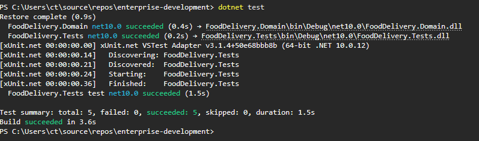

# Система доставки еды (Food Delivery System)

Учебный проект по дисциплине «Разработка корпоративных систем» на платформе .NET 10.

## Описание проекта
Проект представляет собой предметную область **сервиса доставки еды**. Система позволяет управлять информацией о клиентах, ресторанах, блюдах и заказах, а также выполнять аналитические выборки.

---

## Технологический стек
- Платформа: .NET 10.0
- Фреймворк тестирования: xUnit v3
- Continuous Integration: GitHub Actions (автоматический запуск тестов при push)
- Архитектура: Domain-Driven Design (DDD) basics

---

## Структура Лабораторной работы
```
enterprise-development/
├── .github/
│   └── workflows/
│       └── dotnet-ci.yml # конфигурационный файл GitHub Actions для автозапуска тестов
│
├── FoodDelivery.Domain/
│   ├── Entities/
│   │   ├── Client.cs # модель клиента (ФИО, телефон, адрес)
│   │   ├── Dish.cs # модель блюда (название, вес, цена, категория)
│   │   ├── DishCategory.cs # модель категории блюда (справочник)
│   │   ├── Order.cs # модель заказа (клиент, ресторан, даты, итоговая сумма)
│   │   ├── OrderItem.cs # модель позиции в заказе (блюдо, количество, цена)
│   │   └── Restaurant.cs # модель ресторана (название, адрес, рейтинг)
│   ├── DataSeeder.cs # генератор тестового датасета в памяти
│   └── FoodDelivery.Domain.csproj # файл конфигурации проекта домена
├── FoodDelivery.Tests/
│   ├── AnalyticsTests.cs # unit-тесты LINQ-аналитики по требованиям задания
│   ├── DatabaseFixture.cs # фикстура xUnit для повторного использования датасета
│   └── FoodDelivery.Tests.csproj # файл конфигурации проекта тестов
├── FoodDeliverySystem.slnx # файл решения (Solution)
└── README.md # документация и отчёт по лабораторной работе
```

## Запуск и тестирование

### Предварительные требования
-  .NET 10.0 SDK

### Запуск unit-тестов из консоли

```bash
# Клонирование репозитория
git clone https://github.com/catchtimings/enterprise-development.git

# Переход в директорию
cd enterprise-development

# Запуск всех тестов
dotnet test
```

### Результаты тестов

