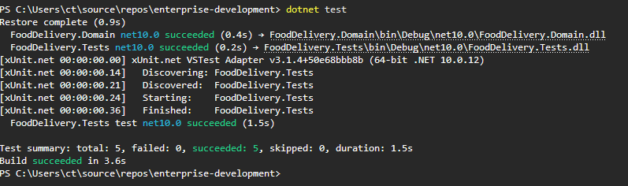

# Система доставки еды (Food Delivery System)

Учебный проект по дисциплине «Разработка корпоративных систем» на платформе .NET 10.

## Описание проекта
Проект представляет собой предметную область **сервиса доставки еды**. Система позволяет управлять информацией о клиентах, ресторанах, блюдах и заказах, а также выполнять аналитические выборки.

Система предоставляет REST API для управления объектами предметной области (рестораны, клиенты, заказы), поддерживает базовые CRUD-операции и предоставляет сложную аналитику по продажам, клиентам и категориям блюд.

---

## Технологический стек
- Платформа: .NET 10.0
- Веб-фреймворк: ASP.NET Core Web API
- Маппинг: AutoMapper
- Документация API: Swagger UI / OpenAPI с интеграцией XML-комментариев
- Фреймворк тестирования: xUnit v3
- Continuous Integration: GitHub Actions (автоматический запуск тестов при push / pull_request)
- Архитектура: Domain-Driven Design (DDD) basics

---

## Структура Лабораторной работы
```
enterprise-development/
├── .github/
│   └── workflows/
│       └── dotnet-ci.yml               # CI/CD пайплайн GitHub Actions
│
├── FoodDelivery.Domain/                # Домен
│   ├── Entities/                       # Модели предметной области (Client, Restaurant, Order и др.)
│   └── DataSeeder.cs                   # Генератор In-Memory датасета
│
├── FoodDelivery.Contracts/             # DTO
│   ├── Dtos/                           # Объекты передачи данных (RestaurantDto, OrderDto и др.)
│   └── Mapper/
│       └── AppMapper.cs                # Профиль AutoMapper для конвертации Domain <-> DTO
│
├── FoodDelivery.Application/           # Бизнес-логика
│   └── Services/
│       └── AnalyticsService.cs         # Сервис LINQ-выборок
│
├── FoodDelivery.Api/                   # REST API
│   ├── Controllers/
│   │   ├── AnalyticsController.cs      # Эндпоинты для аналитики
│   │   └── RestaurantsController.cs    # CRUD-эндпоинты для ресторанов
│   └── Program.cs                      # Конфигурация DI, Swagger и Middleware
│
├── FoodDelivery.Tests/                 # Unit-тесты
│   ├── AnalyticsTests.cs               # Тесты бизнес-логики и аналитики
│   └── DatabaseFixture.cs              # xUnit fixture для изоляции данных
│
└── FoodDeliverySystem.slnx             # Solution файл
```

## Запуск и тестирование

### Предварительные требования
-  .NET 10.0 SDK

### Клонирование и запуск REST API

```bash
# Клонирование репозитория
git clone https://github.com/catchtimings/enterprise-development.git

# Переход в директорию
cd enterprise-development

# Запуск Web API приложения
dotnet run --project FoodDelivery.Api --launch-profile https
```

### Результаты тестов

